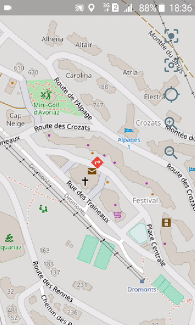

# Livemap

[](https://pub.dartlang.org/packages/livemap)

A map widget with live position updates. Based on [Flutter map](https://github.com/johnpryan/flutter_map) and [Geolocator](https://github.com/BaseflowIT/flutter-geolocator). Provides a controller api to handle map state changes.



**Note**: the map controller api has been moved to 
the [map_controller](https://github.com/synw/map_controller) package. The Livemap controller package is now only responsible for the geolocation related 
controls

## Api

Api for the `LiveMapController` class

### Map controls

#### Center

**`centerOnPosition`**(`Position` *position* ): center the map on a `Position`

**`centerOnLiveMarker()`**: recenter the map on the live position marker

**`toggleAutoCenter()`**: toggle the value of autocenter

**`autoCenter`**: get the current value of autocenter: used when the position updates are on

### Rotation

**`autoRotate`**: automatically rotate the map from bearing

**`rotate`**(`double` degrees): rotate the map

### Position stream

**`togglePositionStreamSubscription()`**: enable or disable the live position stream

### On ready callback

Execute code right after the map is ready:

   ```dart
   @override
   void initState() {
      liveMapController.onLiveMapReady.then((_) {
         liveMapController.togglePositionStreamSubscription();
      });
      super.initState();
   }
   ```

## Example

   ```dart
import 'package:flutter/material.dart';
import 'package:flutter_map/flutter_map.dart';
import 'package:geolocator/geolocator.dart';
import 'package:livemap/livemap.dart';
import 'package:latlong/latlong.dart';

class LiveMapPage extends StatelessWidget {
  LiveMapPage() () {
    mapController = MapController();
    liveMapController = LiveMapController(
      mapController:   mapController,
      autoCenter: true);
  }

  MapController mapController;
  LiveMapController liveMapController;

  @override
  Widget build(BuildContext context) {
    return Scaffold(
        body: LiveMap(
          mapController: mapController,
          liveMapController: liveMapController,
          mapOptions: MapOptions(
            center: LatLng(51.0, 0.0),
            zoom: 13.0,
          ),
          titleLayer: TileLayerOptions(
              urlTemplate: "https://{s}.tile.openstreetmap.org/{z}/{x}/{y}.png",
              subdomains: ['a', 'b', 'c']),
        ),
        bottomNavigationBar: LiveMapBottomNavigationBar(
          liveMapController: liveMapController,
        ));
  }

  @override
  void dispose() {
    liveMapController.dispose();
    super.dispose();
  }
}
   ```

### Changefeed

A changefeed is available: it's a stream with all state changes from the map controller. Ex:

   ```dart
   import 'dart:async';

   StreamSubscription _changefeed;
   int _myzoom;

   liveMapController.onReady.then((_) {
       _myzoom = liveMapController.zoom;
       _changefeed = liveMapController.changeFeed.listen((change) {
        if (change.name == "zoom") {
          setState(() {
              _myzoom = change.value;
          });
        }
      });
   }

   // dispose: _changefeed.cancel();
   ```
